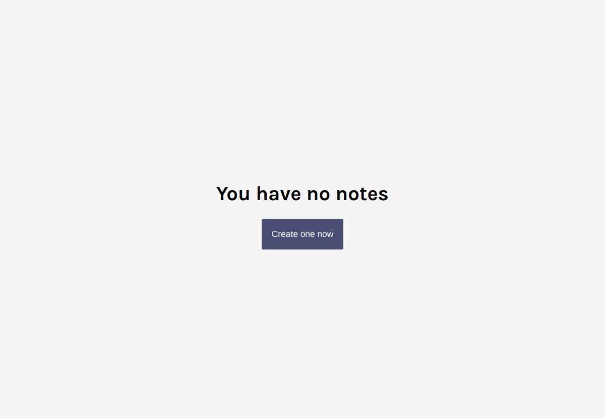
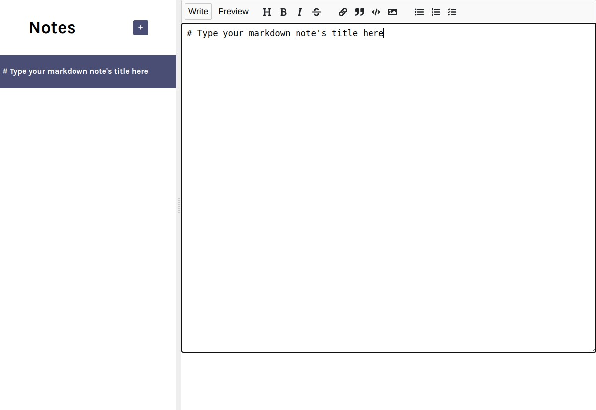
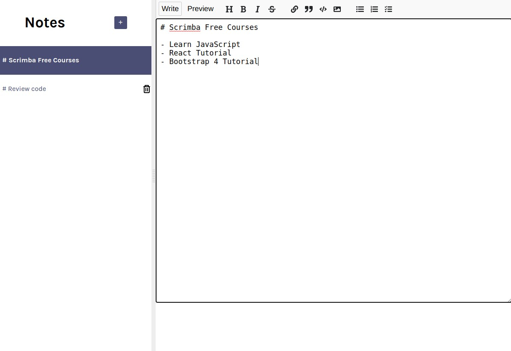
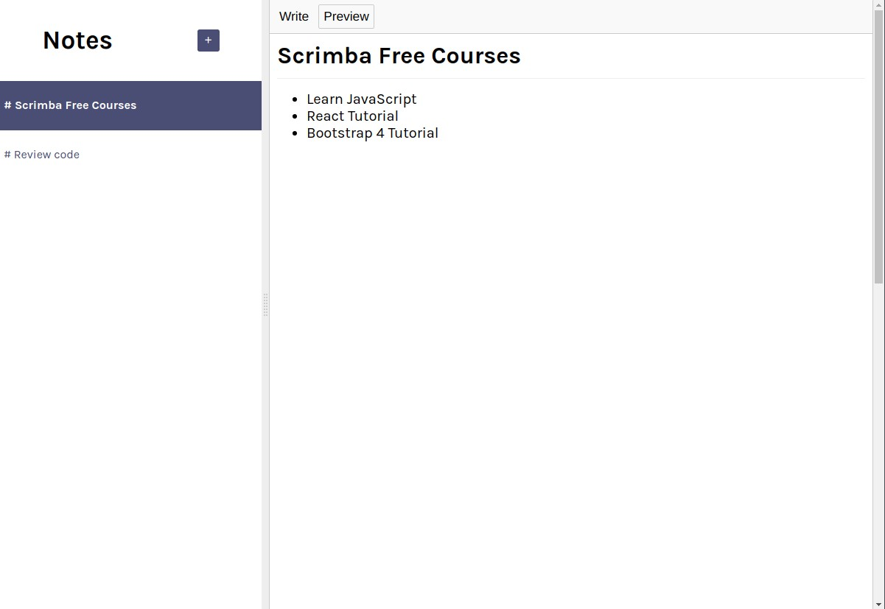

# Notes App
You'll get to know even more features of React by building this handy notes app.

## Table of contents
- [Introduction](#introduction)
- [Overview](#overview)
  - [Screenshot](#screenshot)
  - [Built using](#built-using)
  - [Lessons Applied](#lessons-applied)
- [Author](#author)
- [Acknowledgement](#acknowledgement)
- [Additional Note](#additional-note)

## Introduction
- This is the solution to the fourth part of [Learn React](https://scrimba.com/learn/learnreact).
- This webpage was setup using [Vite](https://vitejs.dev/).
- This webpage features:
    - localStorage synchronization
    - Add, edit and delete options

## Overview
- Link: [github.com/kierhb/notes-app-react](https://github.com/kierhb/notes-app-react)

### Screenshot

### Built using

- HTML5 markup
- CSS
- Vanilla JavaScript
- ReactJS

### Lessons Applied

- Sync notes with local storage
- Add note summary titles
- Move modified notes to the top of the list
- Delete notes

## Author
- Scrimba Team
- GitHub - [@kierhb](https://github.com/kierhb)
- LinkedIn - [Kier Bobila](https://www.linkedin.com/in/kier-bobila/)

## Acknowledgement
I want to acknowledge the course instructor Bob Ziroll, the team who provided the code and to all members of Scrimba community.

## Additional Note
This project was precoded to simulate real job scenarios, the task was to add features and fix some bugs that may pop up.